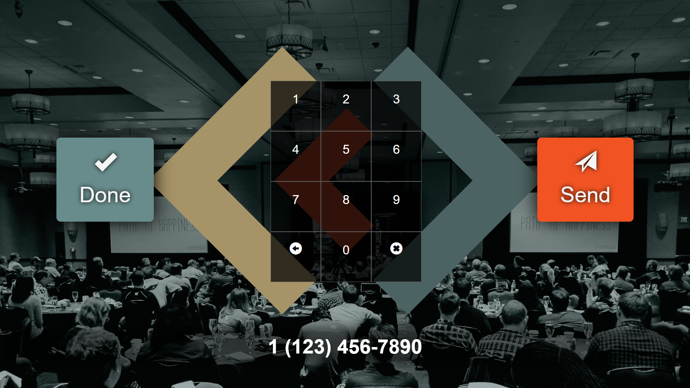

# Cream City Code - Photo Booth App

[](https://davidpine.visualstudio.com/IEvangelist.PhotoBooth/_build/latest?definitionId=1&branch=master)

### Environment Variables

The keys in which our application needs to execute are as follows:

 - `photoboothconnection`
 - `twilioaccountsid`
 - `twilioauthtoken`

You can assign values to these keys from your favorite command line tool.

```cmd
set photoboothconnection "The corresponding value goes here"
```

This is an ASP.NET Core and Angular application. They are hosted separately. As such, it's easiest to start them independently.

### Angular

From the `ClientApp` directory execute the following command:

```cmd
npm start
```

### ASP.NET Core Web API

From the project root directory execute the following command:

```cmd
dotnet run -p .\IEvangelist.ProtoBooth\IEvangelist.ProtoBooth.csproj
```

## Idle


## Countdown


## Presenting


## Send



## Share


